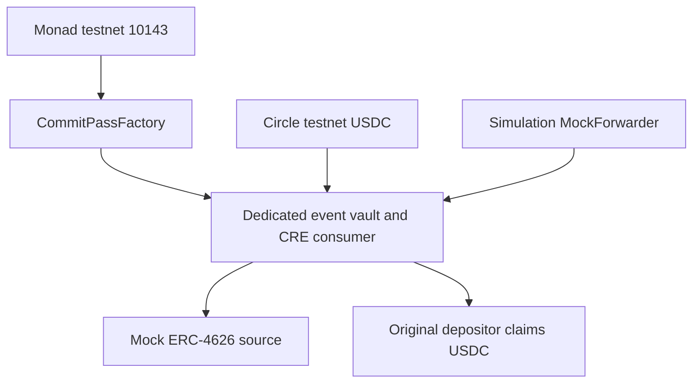

# Chains

The active application uses **Monad testnet**, chain ID **10143**, Circle native testnet USDC and MON for transaction gas.

[Monad Testnet](monad-testnet.md) contains the network configuration and active contract addresses.

Mainnet and additional-chain deployment are not claimed. Test tokens have no financial value; the current yield source is a mock.
