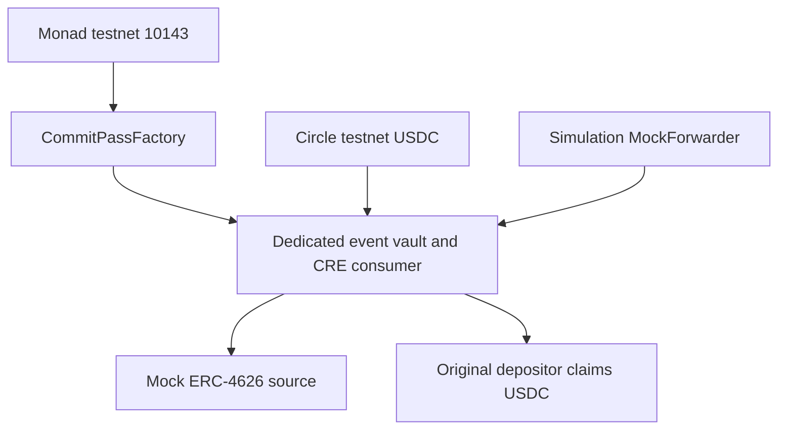

# Chains

The active application uses **Monad testnet**, chain ID **10143**, Circle native testnet USDC and MON for transaction gas.

[Monad testnet](monad-testnet.md) contains the active addresses, source verification and manifest. [Live execution](live-execution.md) records confirmed receipts. Historical networks and deployments from reference projects are not CommitPass deployment evidence.

Mainnet and additional-chain deployment are not claimed. Test tokens have no financial value; the current yield source is a mock.
