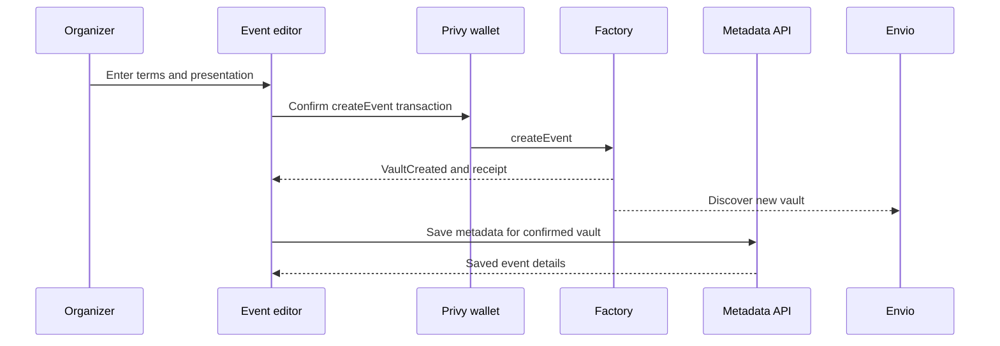

# Event Creation

The organizer selects the commitment, capacity, registration deadline, start time and settlement time. Creation deploys a dedicated event vault and installs its immutable permissions in one transaction.

## Two categories of fields

| Onchain terms | Application metadata |
| --- | --- |
| Organizer and commitment amount | Chosen organizer name and event title |
| Capacity and registration deadline | Description and location |
| Start and settlement times | Cover, appearance and display timezone |
| Treasury, yield source and report authorization | Presentation can be edited by the organizer |

Creation must succeed before metadata is associated with the deployed vault. If metadata or indexing arrives later, the transaction still establishes the event; the app retries or refreshes the read model rather than inventing another vault.

Capacity is limited to 500 participants. An organizer cannot replace the vault's financial policy through an event-description edit.
