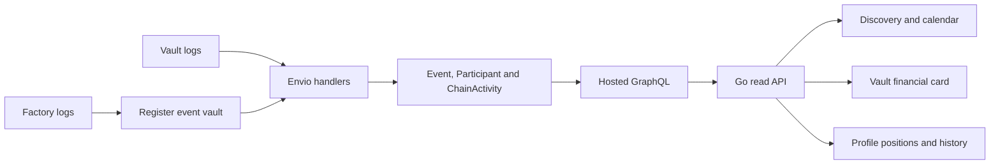

# Data Indexing and Aggregation

Envio provides the read model for public discovery, participants, activity, allocations and claims. Its source is contract logs, rather than a frontend button click.

Metadata enriches indexed events with names, covers, descriptions and locations. It cannot replace contract accounting. Chosen guest names are resolved through an organizer-only application endpoint rather than written into public chain logs.

The vault card distinguishes total commitments, allocations available to collect and confirmed funds returned. Profiles aggregate linked-wallet positions while preserving allocation versus payout meaning.

Indexing can lag a receipt or change following a reorganization. Financial actions use live chain state. Refreshing the read model reconciles a confirmed action without fabricating status or retrying a paid transaction blindly.

[Technical data flow](../technical/envio-and-profiles.md) · [API details](../technical/api-and-data.md)
