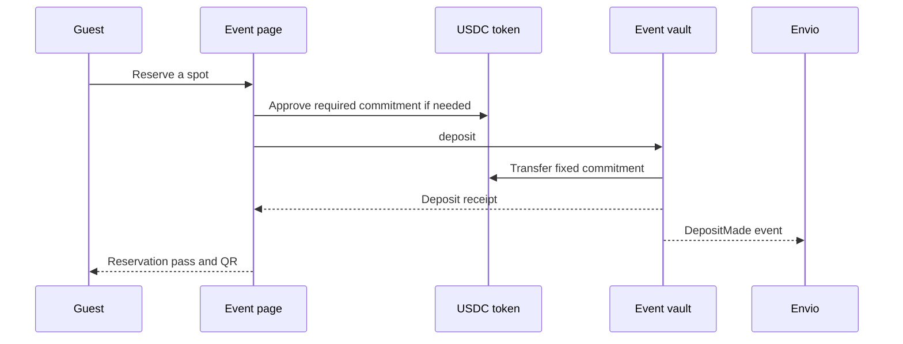

# Participant Registration

Every participant deposits the event's fixed USDC amount from their own wallet. Registration must still be open, capacity available and the wallet not already deposited.

An approval permits spending; it does not reserve a spot. The successful deposit and its event establish participation. The original depositor remains the address entitled to any final claim.

The pass identifies the event and guest wallet. It can be enlarged for scanning, but it is not itself an independent proof of attendance. The organizer must scan or record check-in during the valid window.

If a transaction is pending, inspect or recover that submission before retrying. Envio can lag a confirmed receipt; the app's financial actions use live contract state.

[Guest guide](../guides/guests.md) · [Attendance and trust](../protocol/attendance-and-trust.md)
