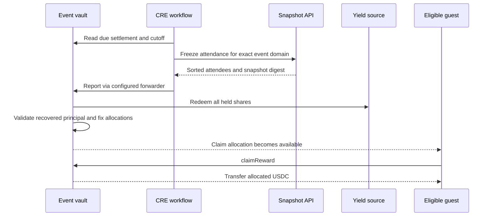
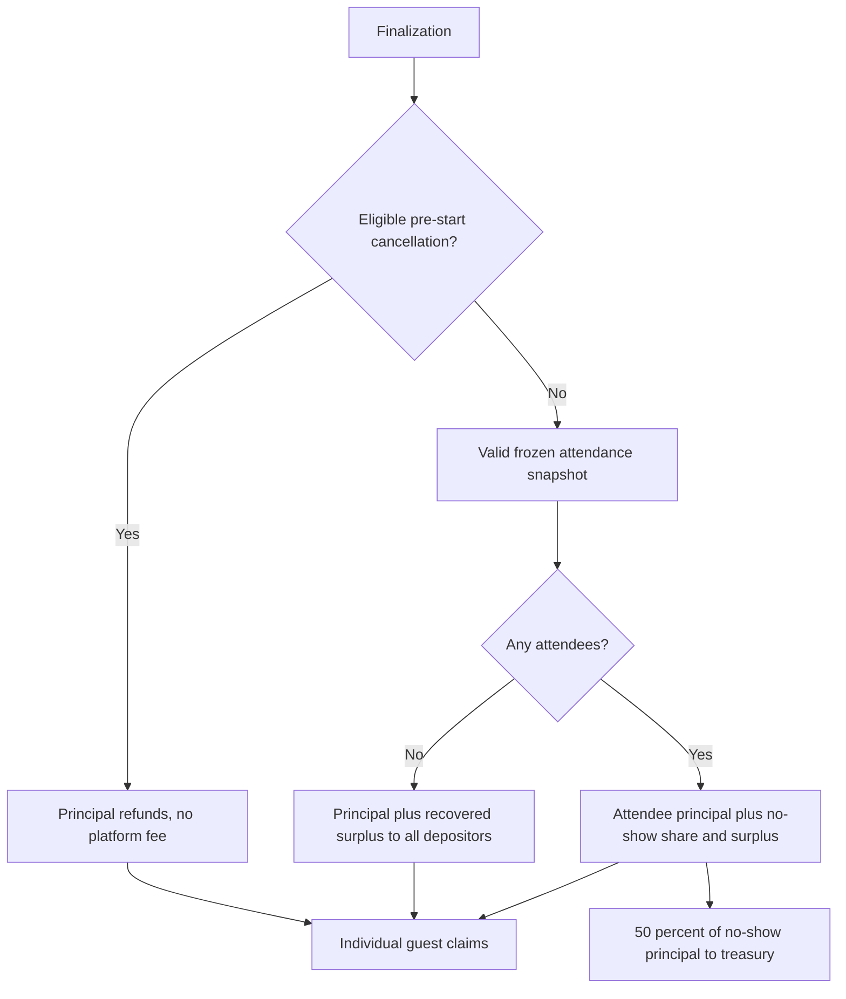

# Settlement and Claims

An organizer end request fixes the cutoff to the earlier of request time and scheduled settlement time. The scheduled cutoff can also make settlement due. Check-in closes at that boundary.

## Which outcome applies?

Unavailable or malformed attendance data defers settlement; it is not interpreted as zero attendance. Redemption failure or a principal shortfall reverts finalization. The current implementation does not guarantee an exit during illiquidity or loss.

`ClaimAllocated` records entitlement. `RewardClaimed` records a completed payment. The guest claims from the original depositing wallet, at most once; MON gas is separate.

[Exact payout rules](../protocol/commitments-and-rewards.md)
