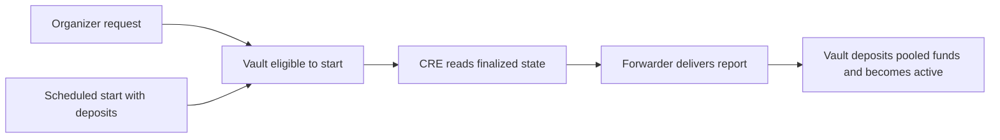
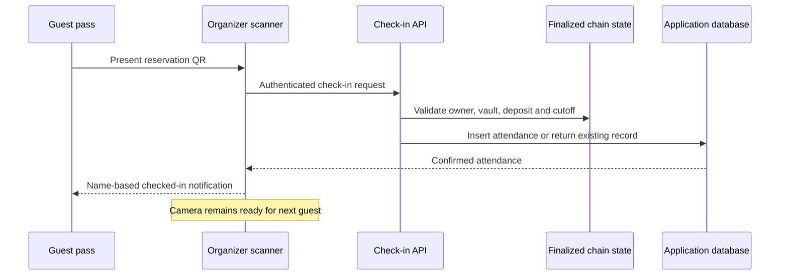

# Event Start and Attendance

An organizer can request an early start when at least one guest has committed. The scheduled start also establishes eligibility. The request closes registration; the event becomes active when the authorized start report executes.

## Continuous QR check-in

The API requires the organizer's verified account, a registered vault, deposited membership, an active event and time before the cutoff. The server supplies timestamps. Duplicate requests are idempotent.

A decoded QR alone is not success. The name notification appears after API confirmation; failures keep attendance unconfirmed. Desktop notifications appear at bottom-right and phone notifications at the top.

Attendance is append-only in this version. The organizer attests presence; the QR does not replace that trust assumption.
