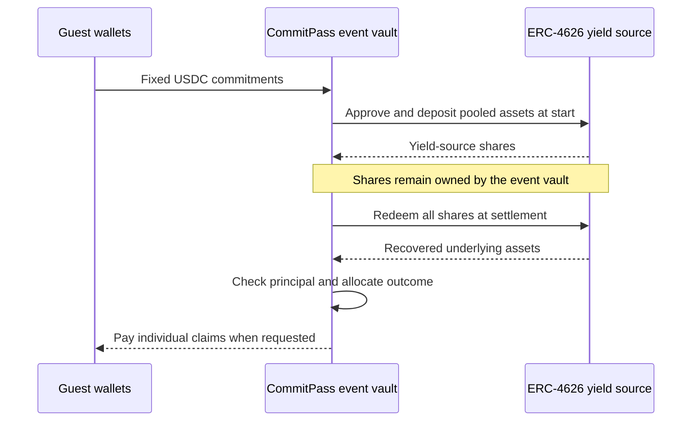

# Yield Vault Lifecycle

The event vault is the lifecycle consumer and claim allocator. Its external yield source implements ERC-4626; these are two separate contracts.

The vault derives the underlying asset from the configured source's `asset()` method. Start deposits pooled assets, then clears allowance. Settlement redeems the source shares before calculating allocations.

## Current source and integration boundary

The active source is `MockYieldVault` on Monad testnet. It validates supply/redemption plumbing without proving organic yield or a Morpho investment. A compatible real vault needs its asset, liquidity, redemption behavior and loss handling evaluated before use.

## Morpho integration target

[Hyperithm USDC Apex](https://app.morpho.org/monad/vault/0x78999cc96d2Ba0341588C60CcB0E91c6C33CF371/hyperithm-usdc-apex) is a Morpho USDC vault on **Monad mainnet**, at [0x78999cc96d2Ba0341588C60CcB0E91c6C33CF371](https://monadscan.com/address/0x78999cc96d2Ba0341588C60CcB0E91c6C33CF371). It is the identified target for evaluating a real yield integration.

CommitPass's active demo uses Monad testnet and a different configured source. Connecting the event funds to this mainnet vault requires a compatible deployment, matching USDC asset and confirmed deposit/redemption transactions. A vault's displayed yield does not establish yield earned by CommitPass.

All recovered surplus is assigned under the payout policy; no yield rate or return is guaranteed. A treasury share applies to no-show principal in normal settlement, not to surplus.

[Contract architecture](../technical/smart-contracts.md) · [Roadmap](../mission/roadmap.md)
