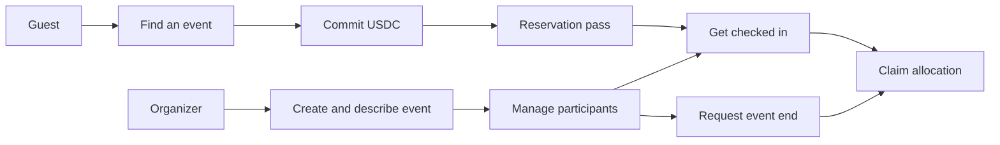

# Features

CommitPass combines familiar event tools with explicit onchain commitments. The current application runs on Monad testnet with test tokens.

| Feature | Experience | Underlying responsibility |
| --- | --- | --- |
| Public discovery | Browse events without signing in | Hosted Envio provides indexed event facts |
| Chosen display names | Hosts and guests use their chosen public name | Privy verifies identity; application records store the name |
| Event creation | Set a commitment, capacity and schedule | Factory deploys one vault per event |
| Event details | Edit description, cover, theme and location | Organizer-authorized API writes |
| Reservation pass | Reserve with USDC and present an enlarged QR | Vault records the original depositor |
| Continuous QR check-in | Scan successive guests and see name notifications | Organizer API validates membership and timing |
| Automated lifecycle | Start and settle from due state | CRE reports are checked by the event vault |
| Claim tracking | Distinguish available returns from collected funds | Allocation and payout logs are separate |

## Current boundaries

CRE uses real testnet broadcasts from CLI simulation, rather than a deployed DON. The ERC-4626 yield source is a mock, so no organic yield is claimed. QR check-in records the organizer's attestation rather than proving physical presence independently.

[How it works](how-it-works.md) · [Deployment status](../deployments/status.md)
