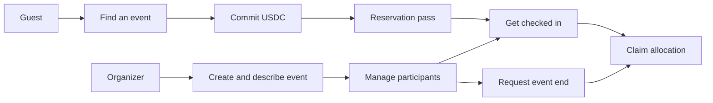

# Features

CommitPass brings reservation, attendance and financial outcomes into the same event experience. Its core capabilities serve both sides of a gathering: guests need a clear way to reserve and collect their return, while organizers need usable tools to create, manage and check in participants.

## 1. Recorded USDC commitments

Every event has a dedicated vault and one commitment amount defined by the host. Guests deposit that amount when reserving a spot.

### Benefits

- A reservation is linked to a recorded deposit and original wallet.
- Separate event vaults keep each event's accounting isolated.
- Contract receipts make deposit and payout outcomes inspectable.

## 2. Attendance-based return rules

The settlement policy connects recorded attendance to principal returns and bonus allocations. Guests claim their allocation after the vault completes settlement.

### Benefits

- Attendees can see the policy before making a commitment.
- Available returns and collected funds are tracked separately.
- Cancellation and zero-attendance exceptions have explicit rules.

See [Commitments and Rewards](../protocol/commitments-and-rewards.md) for the calculation.

## 3. Familiar account access

Public event discovery works before sign-in. Privy provides email or Google authentication and embedded wallet access when a guest is ready to reserve or host.

### Benefits

- Guests can explore the app before creating an account.
- Chosen display names make hosts and participants easier to identify.
- Faucet guidance helps users prepare USDC and MON for the testnet flow.

## 4. Event creation and organizer controls

Hosts set the commitment amount, capacity and schedule, then personalize the description, cover, theme and location. Management separates event details from the participant list.

### Benefits

- The host can manage content and arrivals from the same event workspace.
- Organizer controls replace guest reservation actions for the event owner.
- Lifecycle requests remain tied to the event's owner and contract state.

## 5. Reservation passes and continuous QR check-in

Guests present a reservation QR code. The organizer scanner validates and records attendance automatically, keeps the camera active, and displays a notification using the participant's name.

### Benefits

- Hosts can scan successive participants without restarting the camera.
- The participant table supports lookup and attendance review.
- Duplicate scans are handled without creating duplicate check-in records.

## 6. Lifecycle orchestration and vault insights

CRE reads due events and validates lifecycle inputs. Envio indexes creation, deposits, allocations and claims for event cards and profile history.

### Benefits

- Guests can follow the event's financial progress from one vault view.
- Indexed history connects completed transactions to the application interface.
- Dedicated pages explain the automation, data flow and authorization model.

## 7. ERC-4626 yield lifecycle

Pooled commitments can be supplied to an ERC-4626 source when the event starts and redeemed for settlement. The current source is a mock used to exercise those interfaces; organic yield is not active. CRE currently uses signed CLI broadcasts rather than a deployed Workflow DON.

[Using CommitPass](../guides/overview.md) · [Technical Details](../technical/architecture.md) · [Deployment Status](../deployments/status.md)

## Visual overview

