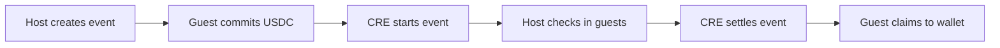

# How CommitPass works

Each event has its own contract vault. The vault holds commitments, accepts authorized lifecycle actions and records the final claim allocations.

## 1. Create

The host sets the event name, cover, description and location, along with capacity, commitment amount, registration deadline and event times. Creating the event deploys a vault and registers its automation schedule atomically. Descriptive content is stored by the application after the chain transaction succeeds.

## 2. Commit

The guest approves the vault to spend the required USDC, then deposits the fixed commitment. A successful deposit reserves the place. A token approval alone does not reserve a spot.

## 3. Start

The host can request a start, or the scheduled start time can make the event eligible. CRE reads the current contract state and submits a report. The contract closes registration and deposits pooled USDC into the configured ERC-4626 vault.

The current testnet yield source is a mock. It does not generate organic yield.

## 4. Check in

The host verifies the attendee and records check-in through the application. The backend validates the organizer, the participant's deposit and the active check-in window.

## 5. Settle

An end request or scheduled cutoff makes settlement eligible. The backend freezes one attendance snapshot for that cutoff. CRE validates the snapshot and writes a report. The event vault redeems its yield shares and fixes the allocations.

## 6. Claim

The guest returns to the event page and confirms a claim transaction. The USDC reaches the original depositing wallet when that transaction succeeds. Envio indexes the receipt so the event page and profile can show the completed payout.

See [For guests](../guides/guests.md) or [For hosts](../guides/hosts.md) for the application steps.
