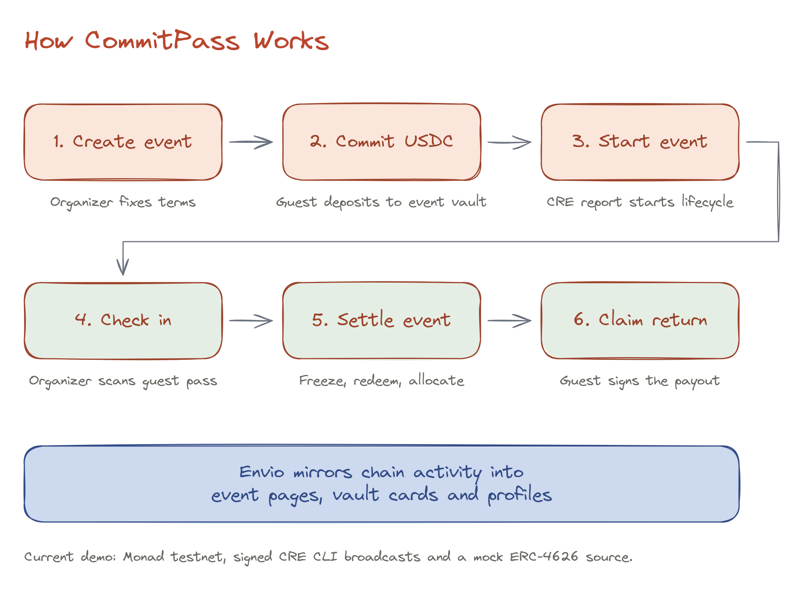
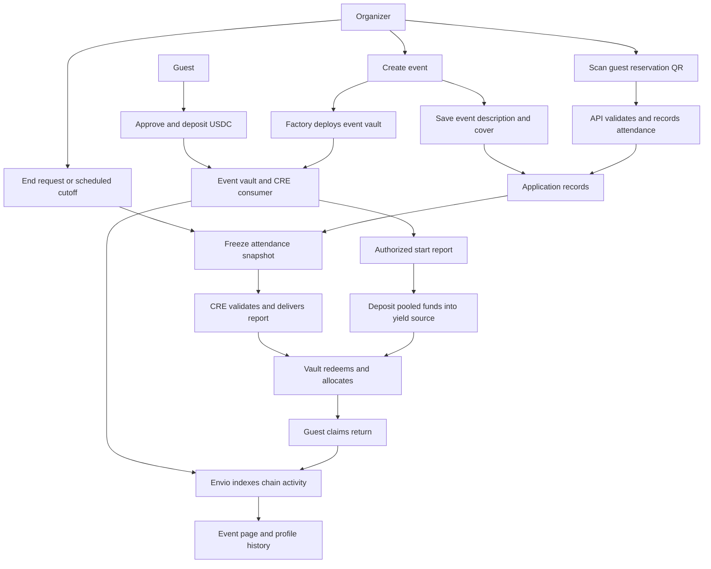
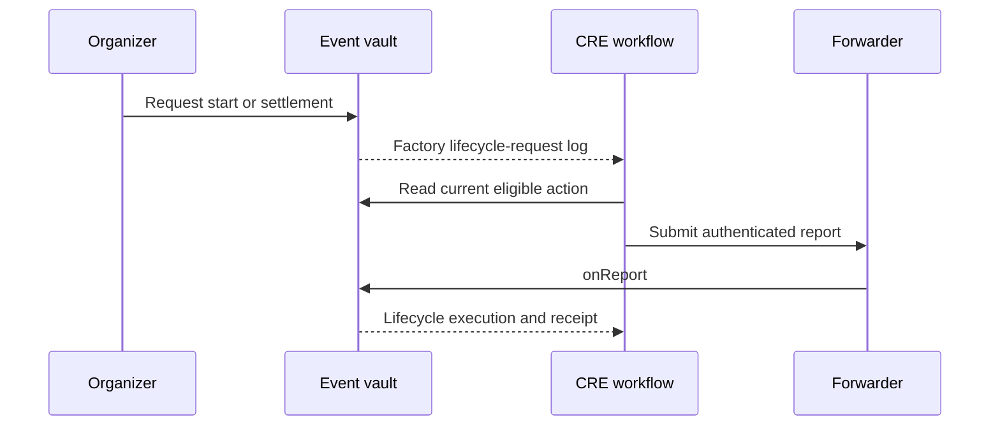

# Overview

CommitPass turns an RSVP into a fixed USDC commitment. Every event has a dedicated vault; the organizer records attendance, CRE orchestrates lifecycle reports, and the vault fixes the resulting guest allocations.

## Visual overview

The sketch gives the order of the guest journey. The Mermaid diagrams below and in each child page explain the calls, data and checks behind those steps.

## The big picture

Read this as three connected flows: **funds** move through the vault; **attendance and metadata** live in the application database; **chain events** become an indexed read model. These are different sources of truth.

## Continue into each stage

| Stage                                                                   | What the detailed page explains                                     |
| ----------------------------------------------------------------------- | ------------------------------------------------------------------- |
| [Event creation](../how-it-works/event-creation.md)                     | Which fields go onchain, metadata persistence and creation receipts |
| [Participant registration](../how-it-works/participant-registration.md) | Approval versus deposit, eligibility and reservation passes         |
| [Start and attendance](../how-it-works/start-and-attendance.md)         | Organizer requests, scheduled starts and continuous QR check-in     |
| [Settlement and claims](../how-it-works/settlement-and-claims.md)       | Frozen snapshots, redemption, allocation and completed payouts      |
| [Yield vault lifecycle](../how-it-works/yield-vault-lifecycle.md)       | ERC-4626 shares and the current test vault                          |
| [Indexing and aggregation](../how-it-works/indexing-and-aggregation.md) | How logs become discovery, vault cards and profiles                 |

## Requests and completed execution

A request does not prove execution. A successful allocation does not prove a claim was paid. Each financial step is established by the corresponding contract receipt.

The current demonstration uses signed CRE CLI broadcast simulation and a mock ERC-4626 yield source. [Technical overview](../technical/architecture.md) explains the components and trust boundaries.
