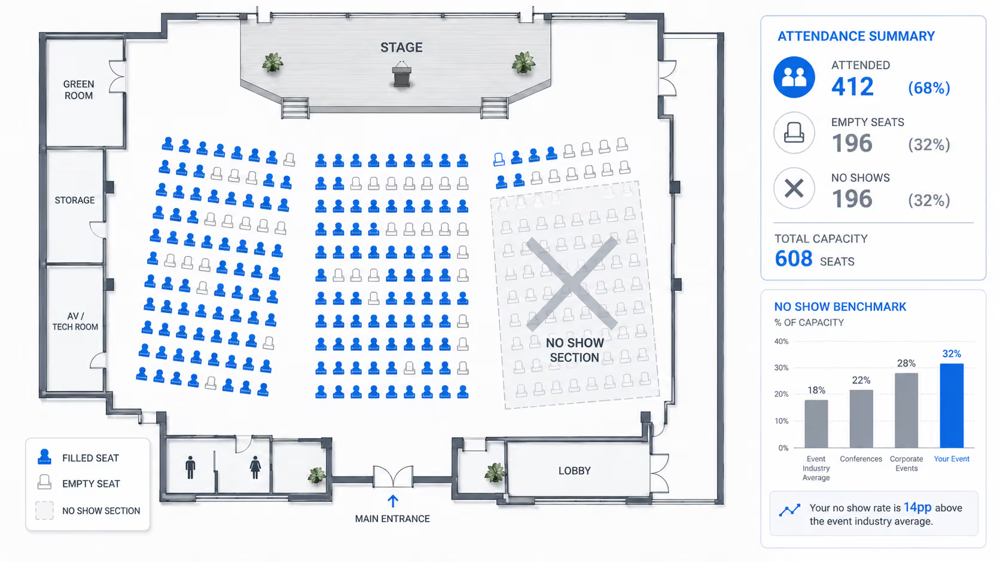

# Problem

Event organizers invest in a gathering before they know who will arrive. A guest list helps them plan, but registering interest and committing to attend are different actions. When these are treated as the same signal, the cost of uncertainty falls on the host and on other potential guests.

## No-show benchmarks: the industry context

[KNVI Labs' 2026 benchmark guide](https://www.knvilabs.com/stories/no-show-rate-definition-and-benchmarks-2026), published on **23 June 2026**, illustrates how no-shows leave planned capacity unused.



*Illustrative venue layout from KNVI Labs: 412 occupied seats and 196 empty seats out of a capacity of 608.*

The guide reports the following no-show ranges for North American events:

| Event category | Reported no-show range |
| --- | --- |
| Free in-person events | **40–60%** |
| Paid virtual events | **35–55%** |
| Free virtual webinars | **50–80%** |

The guide also reports a **14–25%** no-show range for free events using **$3–$25 refundable deposits**. This supports investigating a commitment-based reservation model.

These are estimates published by an event-services provider. The article does not provide a linked dataset or detailed sampling method. They are contextual benchmarks, not measured CommitPass results or guaranteed outcomes for a particular community.

### Measuring the problem

```text
No-show rate = (No-shows / Confirmed registrations) × 100
```

Track cancellations separately and count attendance among registered guests. If there are no eligible registrations, report the rate as not applicable. CommitPass pilots will compare attendance with equivalent prior events where the organizer has usable records.

## 1. Reserved seats can remain empty

A person can reserve a workshop or meetup spot and later decide not to attend. If the event has limited capacity, that reservation may prevent another interested guest from joining. The event loses participation even though demand existed.

## 2. Preparation depends on an uncertain guest list

Rooms, materials, food and volunteer schedules are often planned around registration totals. An unreliable attendance estimate can leave resources unused or make hosts prepare for a different gathering than the one that actually happens.

## 3. The alternatives introduce their own tradeoffs

Overbooking can create capacity problems when more guests arrive than expected. Non-refundable tickets can make participation less attractive to people who intend to attend but do not want to pay for a community gathering. A refundable commitment offers another approach that still needs validation with real users.

## 4. Financial outcomes can be hard to follow

Guests need to understand where their deposit is held, which attendance rules apply, and how a return is calculated. If attendance records, refund decisions and payment history are disconnected, resolving those questions becomes a manual task.

## 5. Wallet setup can interrupt the event experience

Account creation, unfamiliar addresses, token balances and transaction gas add steps for guests who are new to onchain applications. A usable commitment flow must explain these requirements in the context of reserving and attending an event.

## What CommitPass is testing

CommitPass is designed for community meetups, workshops and small gatherings with limited capacity. Its product hypothesis is that a clearly explained refundable commitment can strengthen a reservation and reward attendance.

The testnet implementation demonstrates the funds and attendance workflow. A measured reduction in no-shows, the right commitment amount, and repeat organizer adoption remain questions for user validation.


[Solution](solution.md)

