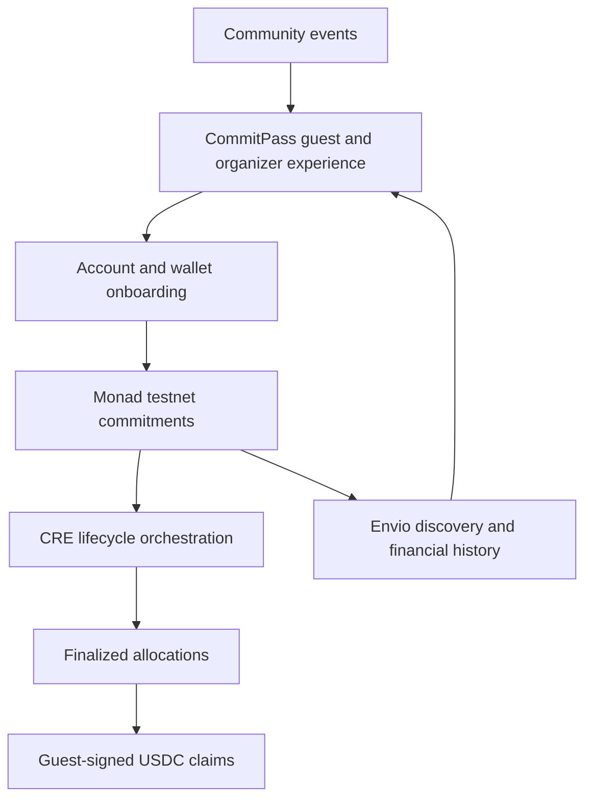

# Contribution to the Monad Ecosystem

CommitPass aims to make onchain commitments useful in a familiar social setting: attending an event. Its contribution to Monad starts with a working application for guests and organizers, supported by contracts, automation and indexed records that developers can inspect.

## 1. Connecting community activity with onchain participation

Meetups and workshops already bring communities together. CommitPass adds a recorded commitment and return flow to that activity, giving guests a concrete reason to interact with USDC deposits, event vaults and claims.

- **A practical user journey:** discovery, reservation, check-in and return collection belong to the same event experience.
- **Familiar onboarding:** Privy account access and chosen names help new users enter the flow.
- **Visible financial outcomes:** each event has its own contract records and claim history.

The goal is useful participation around events. Adoption and attendance improvements will need to be measured with real users.

## 2. Demonstrating an EVM application on Monad

CommitPass uses Solidity contracts and an EVM wallet flow on Monad testnet. The factory deploys dedicated vaults, guests approve and deposit USDC, and the vault enforces report authorization and claim rules.

- **Event-level isolation:** deposits and allocations belong to the relevant event vault.
- **Composable interfaces:** the yield lifecycle uses ERC-4626 deposit and redemption calls.
- **Inspectable execution:** confirmed receipts connect application actions with contract state changes.

The application demonstrates integration behavior; it does not establish network performance benchmarks.

## 3. A concrete automation and indexing pattern

Each event vault is also its own CRE consumer. Lifecycle reports reach the same contract that holds commitments and fixes allocations. Hosted Envio indexes those events for discovery, participant information and financial history.

This architecture provides a reference for connecting an application database, organizer attendance records, automated reports and an onchain accounting system. The technical documentation describes the interfaces and trust boundaries for each component.

## 4. A foundation for further commitment use cases

The current product focuses on events. Over time, the same reservation-and-outcome pattern could inform applications for workshops, community programs and other scheduled activities where participation matters.

Reusable integration examples, a developer SDK and compatible yield sources are development directions. They require further design, validation and review before being presented as supported protocol capabilities.

## Current contribution and evidence

The recorded direct-vault journey covers creation, deposit, organizer check-in, CRE processing and claim through the hosted application. The active network is Monad testnet. The yield source is a mock and CRE uses signed CLI broadcasts.

[Live Execution](../deployments/live-execution.md) contains the receipts. [Roadmap](roadmap.md) explains the next validation and integration stages.

## Visual overview

