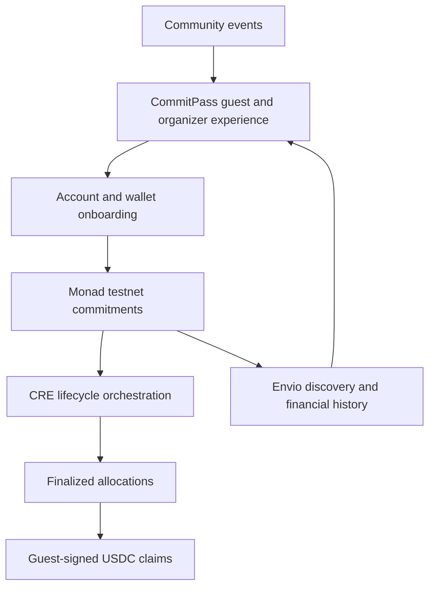

# Contribution to the Monad Ecosystem

CommitPass brings an event reservation and attendance workflow to Monad. Guests interact through an event interface while commitments, lifecycle execution and claims have inspectable chain receipts.

## What the implementation contributes

* A consumer payment flow with USDC commitments and individually claimed returns.
* A dedicated contract per event, making its ownership, deposits and accounting inspectable.
* A concrete CRE consumer pattern: the event vault receives its own lifecycle reports.
* A hosted Envio read model spanning discovery, participants, allocations, payouts and profiles.
* A guest experience using chosen names, passes and QR check-in rather than raw contract operations as the primary interface.

## What the evidence establishes

The recorded direct-vault demo proves a single-attendee journey through the hosted frontend, Privy, the attendance API, CRE broadcast and claim. It does not establish an improvement in attendance rates, production adoption, organic yield or performance benchmarks.

[Live execution](../deployments/live-execution.md) contains the scope and receipts. The current network is Monad testnet, chain ID 10143.
