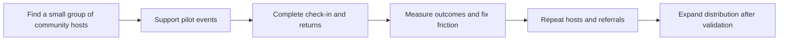
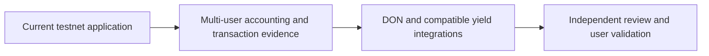

# Roadmap

CommitPass follows a phased development path. The first phase establishes the event commitment experience; later phases strengthen evidence, integrate production services and explore wider adoption. Progress depends on the results of validation and review, rather than fixed calendar promises.

## Go-to-market strategy

CommitPass will enter through organizers who already run a community and can bring their guest list to a pilot event. The first objective is to learn whether a refundable commitment fits their events and whether they choose to use the product again.

### 1. Initial customer: recurring community organizers

We plan to start with Web3 community meetups, builder workshops and small learning events with limited capacity. The first host should have a reachable guest community, a practical attendance problem and willingness to try a new reservation flow.

The organizer is the initial acquisition focus. Guests join through that organizer's event link, so the team can concentrate on making one event work well for both roles.

### 2. Acquisition: direct outreach and assisted pilots

- Build a shortlist of locally reachable community hosts and workshop organizers.
- Demonstrate event creation, refundable commitments, continuous QR check-in and claim collection.
- Help each pilot host configure an event and prepare a short guest onboarding guide.
- Use the host's existing community channels to distribute the event link.
- Share product walkthroughs and pilot learnings through builder communities and social channels.

The [Monad community](https://www.monad.xyz/) is a relevant starting point for finding builders and event organizers. Potential ecosystem collaborations are outreach opportunities, not established partnerships.

**Initial planning target:** work with 3–5 pilot organizers across 5–10 small events. These are proposed pilot targets, not existing traction or delivery commitments. Early trials use testnet tokens until the production readiness work is complete.

### 3. Activation: complete one event journey

The activation milestone is an event that moves from creation to guest reservations, check-in, settlement and completed claims. The pilot should also capture where a guest needs help with sign-in, USDC, MON gas or the return rules.

We will support the first host closely, collect feedback after the event and turn repeated questions into product improvements. A guest who successfully claims their return has completed the experience; a wallet connection alone is not activation.

### 4. Retention and distribution: repeat hosts and referrals

- Invite pilot organizers to run a second event after their first settles.
- Track why hosts return, stop using the product or need manual support.
- Offer reusable event templates and onboarding material where repeated needs appear.
- Ask satisfied organizers for introductions to other hosts.
- Publish consented event stories with measured outcomes once pilot evidence exists.

Repeat organizers are the intended foundation of growth. Each hosted event introduces the product to another set of participants, some of whom may become future organizers.

### 5. Revenue: validate value before expanding pricing

The current contract policy assigns CommitPass 50% of forfeited no-show principal in a normal settlement with attendees. The other half and recovered surplus go to attendees. This is the implemented revenue mechanism, not a forecast of demand or earnings.

Pilot success will be judged primarily by attendance completion, reliable returns and organizer reuse. The team may later evaluate paid organizer tools, analytics or integration services after testing willingness to pay. No subscription plan or additional organizer fee is currently presented as live.

### 6. Metrics and phase gates

| Measure | What we want to learn |
| --- | --- |
| Outreach-to-pilot conversion | Whether the reservation problem matters enough for a host to try CommitPass |
| Time to first published event | Whether organizers can get started with reasonable support |
| Event-view-to-deposit conversion | Whether guests understand and accept the commitment flow |
| Checked-in guests / committed guests | The attendance outcome for each pilot; compare equivalent prior events where data exists |
| Settled events and completed claims | Whether the full financial journey works in practice |
| Hosts running a second event | Whether organizers find continuing value |
| Support effort and recurring issues | Which onboarding and operational friction must be resolved |

After the initial pilots, the team will review these results before broadening acquisition, introducing paid features or planning a mainnet launch. Attendance improvement, customer counts and revenue will be reported only when measured.

### Go-to-market progression

## Phase 1: Event application and testnet foundation

**Status: implemented on Monad testnet, with a recorded single-attendee journey.**

### Core application

- Event discovery, creation and customizable details.
- Privy authentication, embedded wallets and chosen display names.
- Fixed USDC commitments and dedicated event vaults.
- Reservation passes, participant management and continuous QR check-in.
- Lifecycle reports, allocation tracking and guest claims.

### Connected services

- A hosted Next.js frontend and Go API with Neon application records.
- Hosted Envio indexing for events, participants and financial history.
- CRE CLI broadcasts through the simulation forwarder.
- A mock ERC-4626 source for exercising deposit and redemption.

## Phase 2: Multi-user validation and operational reliability

**Status: next validation stage.**

### Financial and lifecycle evidence

- Complete a fresh two-guest journey with one attendee and one no-show.
- Reconcile deposits, allocations, treasury share and paid claims using exact receipts.
- Validate organizer start and end transactions after wallet gas configuration changes.
- Exercise cancellation, duplicate scans and delayed indexing in a hosted user flow.

### Guest and organizer feedback

- Gather feedback on commitment amounts, reservation clarity and check-in usability.
- Review mobile behavior and the distinction between available returns and collected funds.
- Measure attendance outcomes before claiming a reduction in no-shows.

## Phase 3: Production integrations and security review

**Status: integration direction, subject to compatibility and review.**

### Automation

- Configure an actual CRE Workflow DON deployment and production report authorization.
- Verify the selected forwarder, workflow identity and observed lifecycle delivery.
- Define operational monitoring and recovery procedures for delayed execution.

### Yield source and financial readiness

- Evaluate a real ERC-4626 vault for chain, asset, liquidity and security compatibility.
- Validate deposit and redemption behavior, including loss and shortfall handling.
- Conduct an independent security review before a mainnet release decision.

**Tenderly milestone:** the CommitPass team has tested the integration path to [Hyperithm USDC Apex on Morpho](https://app.morpho.org/monad/vault/0x78999cc96d2Ba0341588C60CcB0E91c6C33CF371/hyperithm-usdc-apex) using Tenderly simulation. Production deployment, operational review and observed mainnet accounting remain subsequent steps. The public testnet demo continues to use its mock source.

## Phase 4: Ecosystem integrations and expanded event tools

**Status: longer-term product direction.**

- Publish developer integration examples and consider an SDK for event commitment flows.
- Explore organizer analytics, waiting lists and event notifications based on user demand.
- Pilot the application with communities and workshop hosts.
- Evaluate additional use cases and networks only after the core event flow is validated.

## How progress is assessed

Each phase should produce reviewable evidence: confirmed transactions, reconciled accounting, observed service behavior, security findings or user feedback. Mainnet deployment, broader integrations and adoption milestones remain dependent on that evidence.

## Visual overview

