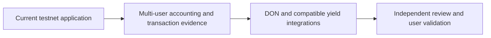

# Roadmap

CommitPass follows a phased development path. The first phase establishes the event commitment experience; later phases strengthen evidence, integrate production services and explore wider adoption. Progress depends on the results of validation and review, rather than fixed calendar promises.

## Phase 1: Event application and testnet foundation

**Status: implemented on Monad testnet, with a recorded single-attendee journey.**

### Core application

- Event discovery, creation and customizable details.
- Privy authentication, embedded wallets and chosen display names.
- Fixed USDC commitments and dedicated event vaults.
- Reservation passes, participant management and continuous QR check-in.
- Lifecycle reports, allocation tracking and guest claims.

### Connected services

- A hosted Next.js frontend and Go API with Neon application records.
- Hosted Envio indexing for events, participants and financial history.
- CRE CLI broadcasts through the simulation forwarder.
- A mock ERC-4626 source for exercising deposit and redemption.

## Phase 2: Multi-user validation and operational reliability

**Status: next validation stage.**

### Financial and lifecycle evidence

- Complete a fresh two-guest journey with one attendee and one no-show.
- Reconcile deposits, allocations, treasury share and paid claims using exact receipts.
- Validate organizer start and end transactions after wallet gas configuration changes.
- Exercise cancellation, duplicate scans and delayed indexing in a hosted user flow.

### Guest and organizer feedback

- Gather feedback on commitment amounts, reservation clarity and check-in usability.
- Review mobile behavior and the distinction between available returns and collected funds.
- Measure attendance outcomes before claiming a reduction in no-shows.

## Phase 3: Production integrations and security review

**Status: integration direction, subject to compatibility and review.**

### Automation

- Configure an actual CRE Workflow DON deployment and production report authorization.
- Verify the selected forwarder, workflow identity and observed lifecycle delivery.
- Define operational monitoring and recovery procedures for delayed execution.

### Yield source and financial readiness

- Evaluate a real ERC-4626 vault for chain, asset, liquidity and security compatibility.
- Validate deposit and redemption behavior, including loss and shortfall handling.
- Conduct an independent security review before a mainnet release decision.

[Hyperithm USDC Apex on Morpho](https://app.morpho.org/monad/vault/0x78999cc96d2Ba0341588C60CcB0E91c6C33CF371/hyperithm-usdc-apex) is the identified mainnet vault to evaluate. The current testnet deployment remains connected to a mock source; confirmed deposit and redemption records are required to establish an active integration and earned yield.

## Phase 4: Ecosystem integrations and expanded event tools

**Status: longer-term product direction.**

- Publish developer integration examples and consider an SDK for event commitment flows.
- Explore organizer analytics, waiting lists and event notifications based on user demand.
- Pilot the application with communities and workshop hosts.
- Evaluate additional use cases and networks only after the core event flow is validated.

## How progress is assessed

Each phase should produce reviewable evidence: confirmed transactions, reconciled accounting, observed service behavior, security findings or user feedback. Mainnet deployment, broader integrations and adoption milestones remain dependent on that evidence.

[Technical Details](../technical/architecture.md)

## Visual overview

