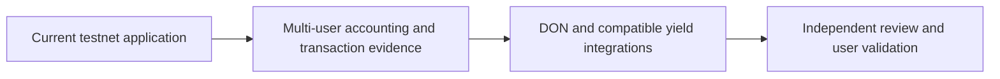

# Roadmap

The roadmap separates existing implementation from further integration and validation. These directions are not dated delivery promises.

| Stage | Status | Evidence or completion criterion |
| --- | --- | --- |
| Event and commitment application | Implemented on testnet | Hosted discovery, creation, reservation, check-in and claim |
| Direct-vault CRE consumer | Implemented | Current factory and verified demo vault |
| Single-attendee journey | Recorded | Current-contract creation through claim receipts |
| Hosted indexing and vault insights | Implemented | Envio-backed events, financial history and profiles |
| Independent two-guest journey | Next validation | One attendee and one no-show, with exact allocation and payout receipts |
| Manual lifecycle transaction regression | Next validation | Fresh organizer start/end requests after wallet gas configuration changes |
| Deployed CRE workflow | Integration direction | Actual DON workflow identity, forwarder configuration and observed reports |
| Compatible real yield vault | Integration direction | Asset, liquidity, loss and deposit/redemption behavior verified for a selected vault |
| Independent audit and attendance validation | Further work | External review and measured real-user evidence |

## Yield integration direction

The contracts use ERC-4626 deposit and redemption interfaces. Morpho vaults are a possible integration target, subject to network availability, asset compatibility, liquidity and security review. The current deployed source remains a mock; an actual Morpho connection or return is not claimed.

[Deployment status](../deployments/status.md) · [Yield vault lifecycle](../how-it-works/yield-vault-lifecycle.md)
