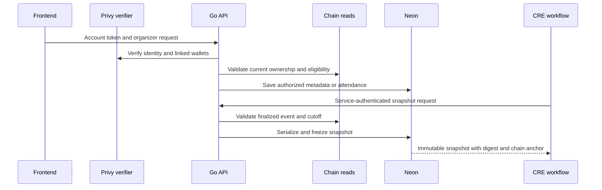

# API and Application Data

The Go API serves indexed event data and manages application records. The hosted base URL is:

```
https://commitpass-api.endpx.cloud
```

## Where data is stored

- **Onchain, in Monad contracts:** event financial parameters, deposit membership, lifecycle state, allocations and claims.
- **Offchain, in Neon:** account profiles, verified wallet links, event metadata, check-ins and frozen attendance payloads.
- **Offchain, in hosted Envio:** indexed copies of contract events and aggregates used by public read endpoints.

The API combines these layers when presenting an event. It reads chain ownership and membership to authorize application writes. A display name or check-in database row is not a token transfer. At settlement, the vault records the accepted attendance outcome and snapshot hash; the complete application snapshot remains in Neon.

## Public chain reads

| Route                                           | Purpose                                      |
| ----------------------------------------------- | -------------------------------------------- |
| `GET /health`                                   | Process liveness and release information     |
| `GET /v1/events`                                | Indexed events and aggregates                |
| `GET /v1/events/{vault}`                        | One event's indexed state                    |
| `GET /v1/events/{vault}/participants`           | Deposits, allocations and claim information  |
| `GET /v1/events/{vault}/activity`               | Transaction and block references             |
| `GET /v1/wallet-profile?wallets=...`            | Public participation and financial summaries |
| `GET /v1/wallet-positions?wallets=...&kind=all` | Paginated public event positions             |

Onchain integer values and timestamps are decimal strings. Indexed list endpoints return up to 100 records and a `nextCursor`; use `after` to continue. Responses identify the Envio source and chain ID.

For example:

```sh
curl https://commitpass-api.endpx.cloud/v1/events/0x5f50ad692ee6e5196d7186b2a57c637e46b9e3a8
```

`/health` proves the process is running. It is not a full database, indexer or chain readiness check.

## Authenticated application records

Privy token verification and wallet-link synchronization establish identity. Metadata writes and check-in writes also require the relevant event ownership and chain checks. A public read filter never grants write authority.

Application tables include:

* `users` and `wallet_links` for account identity and verified wallets.
* `events` for descriptions associated with a validated chain event.
* `check_ins` for server-timestamped attendance and audit fields.
* `attendance_snapshots` for immutable settlement payloads.

The application schema is separate from Envio's indexed entities. Envio does not write attendance snapshots.

## Snapshot service

```
POST /v1/attendance-snapshots/{chainId}/{vault}/{eventId}/{cutoff}
GET  /v1/attendance-snapshots/{chainId}/{vault}/{eventId}/{cutoff}
```

These routes require a service bearer token, separate from a participant's Privy session. POST freezes once; retries return the same saved snapshot. GET reads an existing snapshot.

The payload includes `version`, `chainId`, `vault`, `eventId`, `cutoff`, `frozen`, sorted `attendees`, and `snapshotHash`. It is bound to finalized chain state and checked for canonicality on later reads.

A snapshot records attendance input. It does not prove redemption, allocation or payout succeeded; those are established by contract receipts and indexed logs.

## Chosen names and guest lookup

`PUT /v1/me` stores a chosen name and profile completion. `GET /v1/events/{vault}/guest-profiles?wallets=...` requires the current organizer and accepts up to 100 validated wallet addresses. Only names from completed profiles and active verified links are returned. `PUT /v1/events/{vault}/check-ins/{wallet}` validates ownership, membership and the attendance window; retries return existing records.

## Application and snapshot boundaries



Participant sessions and the CRE service credential are separate. A public indexed read filter does not grant write authority, and the snapshot endpoint does not transfer participant funds.
