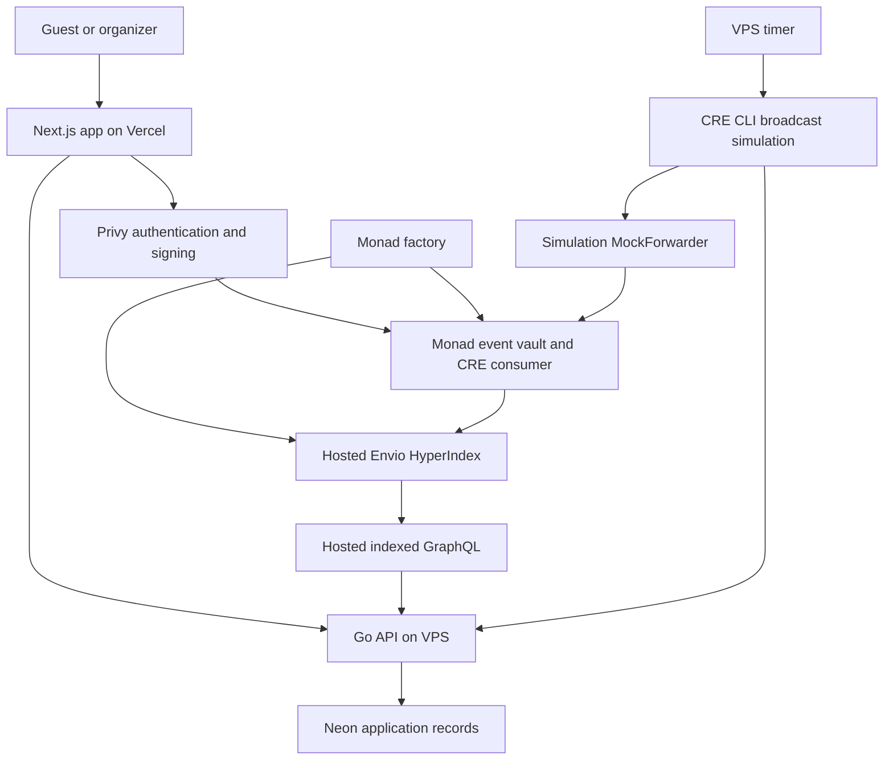

# System architecture

CommitPass separates financial execution, attendance records and indexed reads.

## Financial execution

The factory creates a dedicated vault per event. Guests deposit directly into it. The same vault receives authenticated CRE reports, supplies or redeems yield shares, fixes allocations and transfers claims. There is no separate lifecycle automation contract in the active deployment.

Privy provides authentication and wallet signing. The Go API does not hold participant private keys or replace participant signatures.

## Attendance and metadata

The Go API stores chosen display names, descriptions, covers, themes, check-ins and immutable snapshots in Neon. Organizer writes require verified identity and current event ownership. QR scanning automatically requests check-in; the API enforces deposited membership and the attendance window.

A metadata row is not proof of deposit, settlement or payout.

## Indexed reads

The active indexer is hosted in the EndPx Envio organization. It discovers vaults from factory logs and materializes events, participants, allocations, claims and activity. The Go API reads hosted GraphQL. The earlier self-hosted indexer is stopped.

Profiles and vault cards use indexed records. Financial actions also read current contract state. An allocation is distinct from a completed payout.

## CRE runtime

A VPS timer invokes CRE CLI simulation with broadcast. Cron reads bounded factory batches and an EVM log callback processes organizer requests. Both share lifecycle processing. Reports travel through the MockForwarder directly to the event vault.

This is real Monad testnet execution through signed simulation. A Workflow DON deployment and organic yield are not active.

| Component | Hosting |
| --- | --- |
| Frontend | Vercel |
| API and CRE CLI timer | VPS |
| Application records | Neon |
| Active indexer and indexed GraphQL | Hosted Envio |
| Factory, event vaults and mock yield source | Monad testnet |

[Smart contracts](smart-contracts.md) · [CRE](chainlink-cre.md) · [Envio](envio-and-profiles.md)
