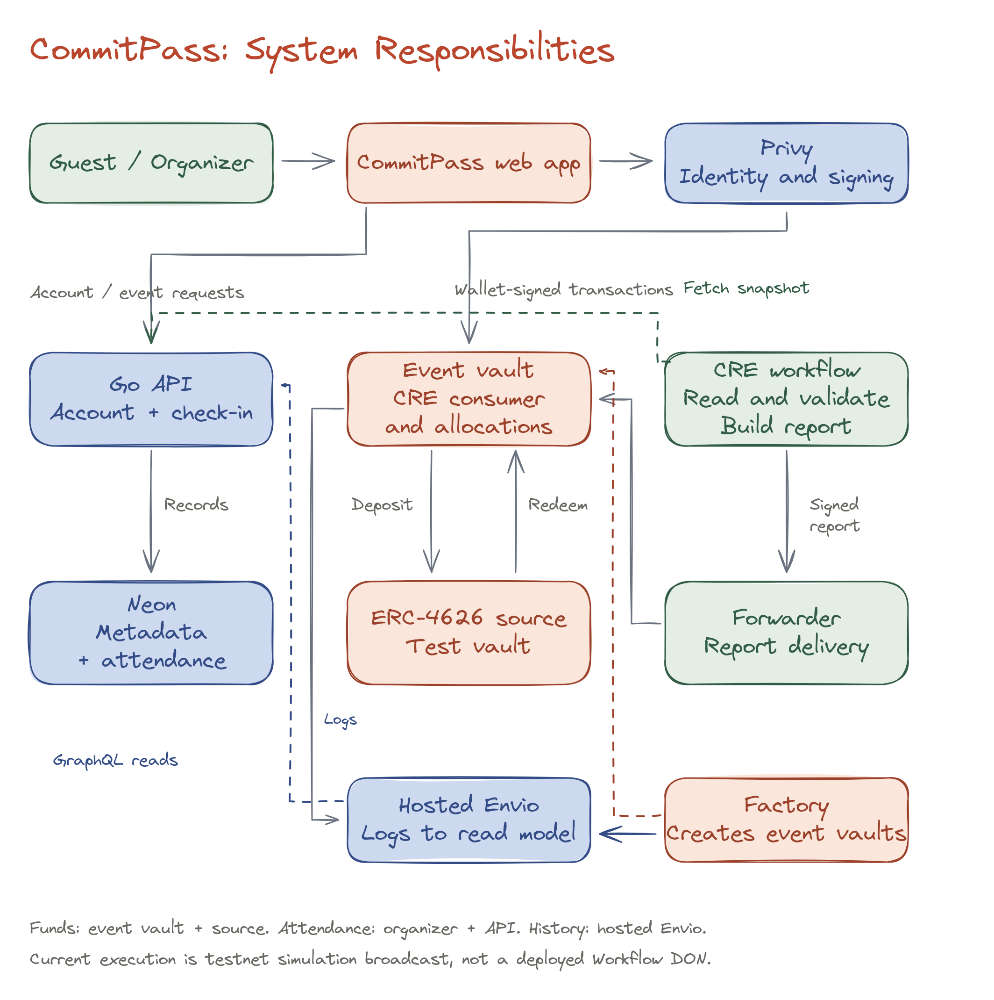
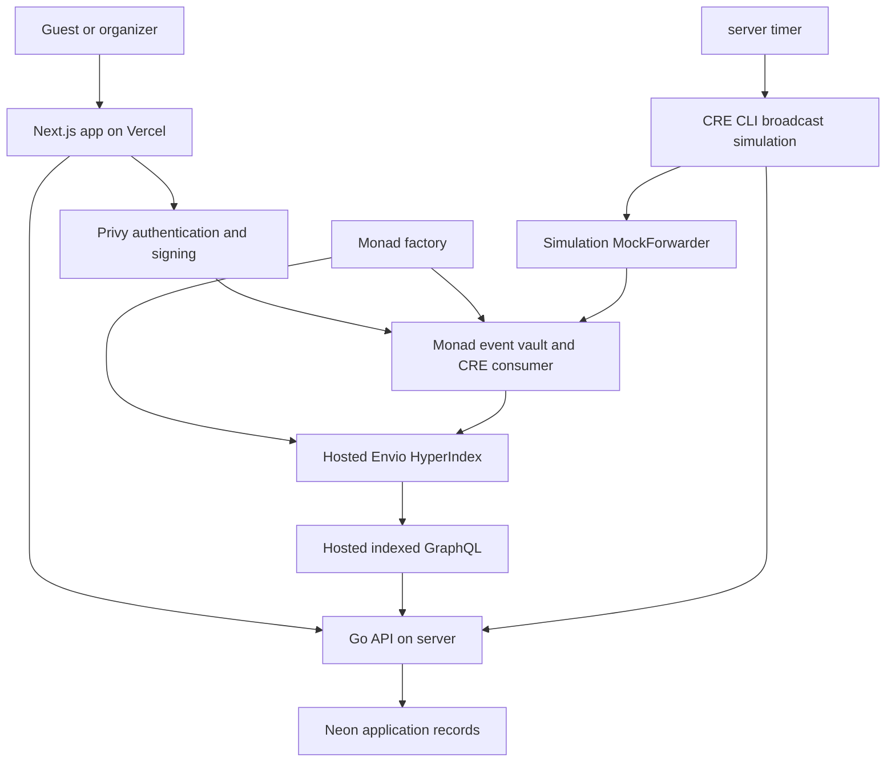
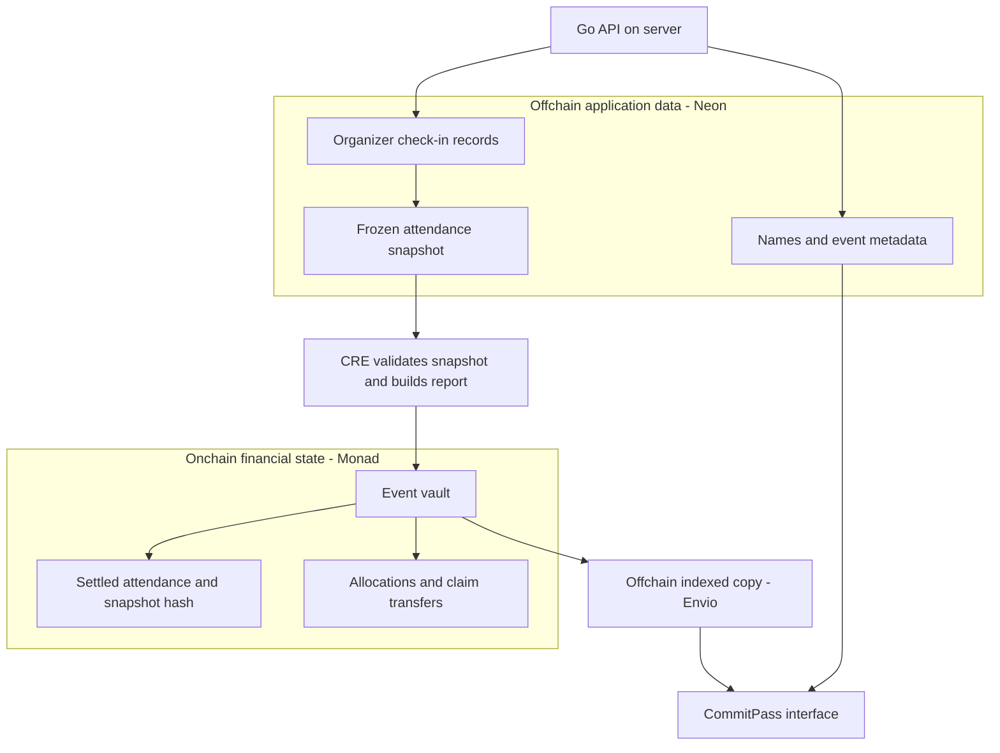
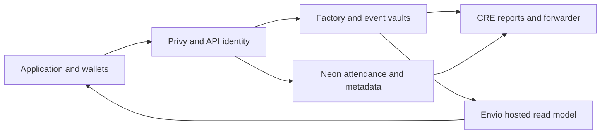

# Overview

CommitPass separates financial execution, attendance records and indexed reads.

## Component map

Terracotta boxes are financial components, blue boxes represent identity and data services, and green boxes show actors or report delivery. The sketch identifies responsibilities; the Mermaid view below makes the complete data relationships explicit.

## Financial execution

The factory creates a dedicated vault per event. Guests deposit directly into it. The same vault receives authenticated CRE reports, supplies or redeems yield shares, fixes allocations and transfers claims. There is no separate lifecycle automation contract in the active deployment.

Privy provides authentication and wallet signing. The Go API does not hold participant private keys or replace participant signatures.

## Attendance and metadata

The Go API stores chosen display names, descriptions, covers, themes, check-ins and immutable snapshots in Neon. Organizer writes require verified identity and current event ownership. QR scanning automatically requests check-in; the API enforces deposited membership and the attendance window.

A metadata row is not proof of deposit, settlement or payout.

## Indexed reads

The active indexer is hosted in the EndPx Envio organization. It discovers vaults from factory logs and materializes events, participants, allocations, claims and activity. The Go API reads hosted GraphQL. The earlier self-hosted indexer is stopped.

Profiles and vault cards use indexed records. Financial actions also read current contract state. An allocation is distinct from a completed payout.

## CRE runtime

A server timer invokes CRE CLI simulation with broadcast. Cron reads bounded factory batches and an EVM log callback processes organizer requests. Both share lifecycle processing. Reports travel through the MockForwarder directly to the event vault.

This is real Monad testnet execution through signed simulation. A Workflow DON deployment and organic yield are not active.

## Onchain and offchain data storage

CommitPass keeps financial state on Monad and application records in an offchain database. Envio maintains an indexed copy of chain activity so the interface can query it efficiently.

| Data                                                                      | Storage layer                      | Stored in                                   | Purpose                                                       |
| ------------------------------------------------------------------------- | ---------------------------------- | ------------------------------------------- | ------------------------------------------------------------- |
| Event owner, commitment amount, capacity and contract deadlines           | **Onchain**                        | Monad factory and event vault               | Enforce the event's financial configuration                   |
| Depositor wallets, deposited amounts and participant membership           | **Onchain**                        | Event vault                                 | Record who committed funds and can receive an allocation      |
| Lifecycle state, yield shares, settled attendance flags and snapshot hash | **Onchain**                        | Event vault and ERC-4626 source             | Execute and bind financial settlement to its attendance input |
| Guest allocations, protocol revenue and completed claims                  | **Onchain**                        | Event vault state, token transfers and logs | Calculate and record financial outcomes                       |
| Display names and verified account-to-wallet links                        | **Offchain**                       | Neon application database                   | Connect authenticated accounts to readable profiles           |
| Event description, cover, theme and location metadata                     | **Offchain**                       | Neon application database                   | Present and manage the event experience                       |
| Organizer check-in records and timestamps                                 | **Offchain**                       | Neon application database                   | Record attendance before settlement                           |
| Frozen attendance payload and supporting audit fields                     | **Offchain**                       | Neon application database                   | Supply an immutable input for CRE validation                  |
| Searchable events, participants, allocations and transaction history      | **Offchain index of onchain data** | Hosted Envio                                | Provide indexed reads for discovery, vault cards and profiles |

### How the layers connect

**Onchain** records are public financial facts enforced by contracts. **Offchain** records support identity, presentation and attendance operations. The full check-in record stays offchain; settlement records the accepted attendance outcome and snapshot hash onchain. Envio reproduces chain activity for reads and does not replace the underlying contract state.

## Read the overview before the implementation details

| Detail page                                            | Part of the big picture                                                  |
| ------------------------------------------------------ | ------------------------------------------------------------------------ |
| [Smart Contract Architecture](smart-contracts.md)      | Factory, vault, external yield source and immutable report authorization |
| [Chainlink CRE Workflow](chainlink-cre.md)             | Trigger discovery, snapshot validation and report delivery               |
| [Data Flow and Indexing](envio-and-profiles.md)        | Logs, entities, GraphQL, vault cards and profile aggregates              |
| [API and Application Data](api-and-data.md)            | Identity, metadata, chosen names, attendance and frozen snapshots        |
| [Authorization and Trust Boundaries](authorization.md) | Permissions for each actor and remaining assumptions                     |

Read the diagram as a map of responsibilities. Each child page explains the corresponding interfaces, state and failure boundaries.
