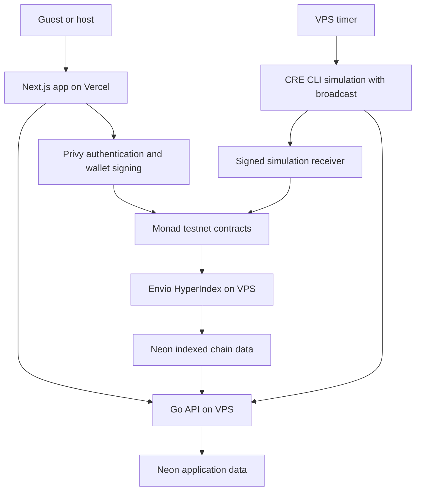

# System architecture

CommitPass separates financial execution, attendance records and indexed read models.

## Financial execution

The factory creates a dedicated vault for each event. Guests deposit USDC directly into that vault. The automation receiver applies authorized start and settlement reports. The vault redeems yield shares, fixes claim allocations and transfers participant claims.

Wallet transactions are signed through Privy. The Go API does not hold participant private keys or replace participant signatures.

## Attendance and metadata

The Go API manages descriptions, account synchronization, check-ins and frozen attendance snapshots in Neon application tables. These writes require the relevant identity and ownership checks.

Descriptions and covers enrich an onchain event. They do not determine financial truth. A saved database row is not a deposit, settlement or payout receipt.

## Indexed read model

Envio discovers event vaults from the factory, consumes their contract logs and writes the indexed state into a separate database/schema. The Go API reads that state for event discovery, participants, profiles and activity.

The active testnet namespace is `envio_usdc_simulation`. Earlier namespaces are preserved and are not combined into current USDC financial totals.

## Automation runtime

The current VPS timer repeatedly invokes the cron callback through CRE CLI simulation with `--broadcast`. The workflow has a finalized EVM log callback for organizer lifecycle requests as well. Both callbacks use the same event-processing logic.

The runtime reads Monad testnet RPC and the HTTPS attendance API. The signed simulation receiver supplies a specific testnet authorization path while DON deployment remains deferred.

## Deployment split

| Component                      | Hosting           |
| ------------------------------ | ----------------- |
| Next.js frontend               | Vercel            |
| Go API                         | VPS, behind HTTPS |
| Envio indexer                  | VPS               |
| CRE CLI simulation timer       | VPS               |
| Application and indexed tables | Neon PostgreSQL   |
| Event contracts and USDC       | Monad testnet     |

The frontend uses its Vercel URL. The API has a separate HTTPS domain.
