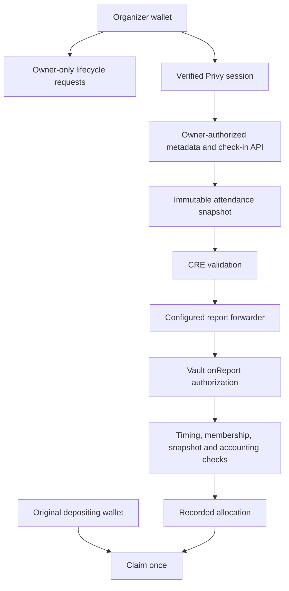

# Authorization and Trust Boundaries

Different actors have different permissions. Authentication, contract ownership and report authorization solve different problems.

| Actor | Allowed operation | Limit |
| --- | --- | --- |
| Organizer | Request start/end; attest attendance; edit metadata | Cannot override immutable report permissions or payout policy |
| Participant | Deposit once and claim their allocation once | Cannot check in another guest or execute a lifecycle report |
| Forwarder | Deliver reports to `onReport` | Workflow metadata or simulation signature must also match |
| Snapshot service | Freeze organizer-recorded attendance | Cannot prove physical presence or execute token claims |
| Indexer | Materialize emitted chain facts | Cannot authorize financial writes |

## Current execution trust

The active testnet receiver checks its immutable MockForwarder and EIP-712 simulation signer. The operator controls that signing credential and runtime availability. Standard mode uses an actual nonzero workflow identity; a deployed DON is not currently claimed.

The organizer remains the attendance authority. Append-only records preserve the submitted attestation but do not establish that it was truthful. Source verification is distinct from an independent audit.

[Attendance policy](../protocol/attendance-and-trust.md) · [CRE authorization](chainlink-cre.md)
