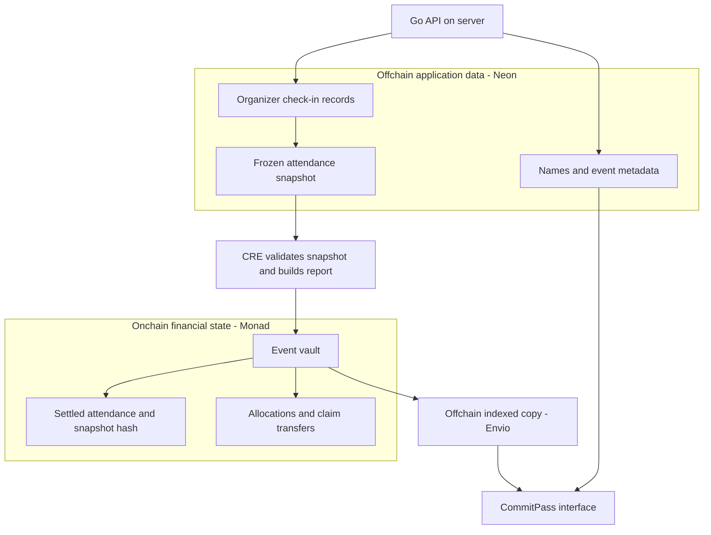

# Onchain and Offchain Data

CommitPass uses three connected data layers. **Monad contracts** hold the financial state. **Neon** holds application and attendance records. **Envio** maintains searchable copies of chain activity for the interface.

## 1. Onchain: financial records on Monad

These records are public contract state or transaction logs. Contracts enforce deposits, settlement and claim eligibility.

| Data | Stored in |
| --- | --- |
| Event owner, commitment amount, capacity and financial deadlines | Factory and event vault |
| Depositor wallets, commitment amounts and participant membership | Event vault |
| Event lifecycle state and finalized attendance flags | Event vault |
| Accepted settlement snapshot hash | Event vault |
| Yield-source shares and underlying token transfers | Event vault, ERC-4626 source and USDC contract |
| Guest allocations, protocol revenue and paid claims | Event vault state and transaction logs |

The wallet deposit and completed claim are onchain financial facts. A change in the application database cannot create a deposit or pay a claim.

## 2. Offchain: application records in Neon

The Go API manages these records after authentication and permission checks. They make events readable and support the organizer's attendance workflow.

| Data | Stored in |
| --- | --- |
| Chosen display names and account profiles | Application users |
| Verified account-to-wallet links | Application wallet links |
| Event descriptions, cover references, themes and locations | Event metadata |
| Organizer check-ins, timestamps and audit fields | Check-in records |
| Frozen attendance payloads and supporting chain anchors | Attendance snapshots |

Event metadata is separate from financial parameters enforced by the vault. Check-in records remain offchain before settlement; the accepted attendance outcome and snapshot hash are later recorded onchain.

## 3. Offchain index: chain history in Envio

Envio reads factory and vault logs and creates indexed entities for events, participants and activity. The API uses hosted GraphQL to serve discovery, vault cards, profile history and financial aggregates.

This is an **offchain copy of onchain data**. It improves query access without becoming the authority for financial state. Indexing can lag a confirmed transaction, so financial actions also read the contracts directly.

## How the layers connect

1. The guest deposits USDC; the event vault records the commitment onchain.
2. The organizer scans the reservation QR; the API records attendance in Neon.
3. The API freezes the attendance snapshot; CRE validates it and prepares the report.
4. The vault accepts the report, records the attendance outcome and snapshot hash, and fixes allocations onchain.
5. The guest claims; the token transfer is an onchain transaction.
6. Envio indexes the resulting logs so the interface can display the history.

The full application snapshot stays in Neon. Its accepted digest and resulting attendance outcome are recorded by the event vault. Display names and event descriptions do not become token transfers or financial permissions.
