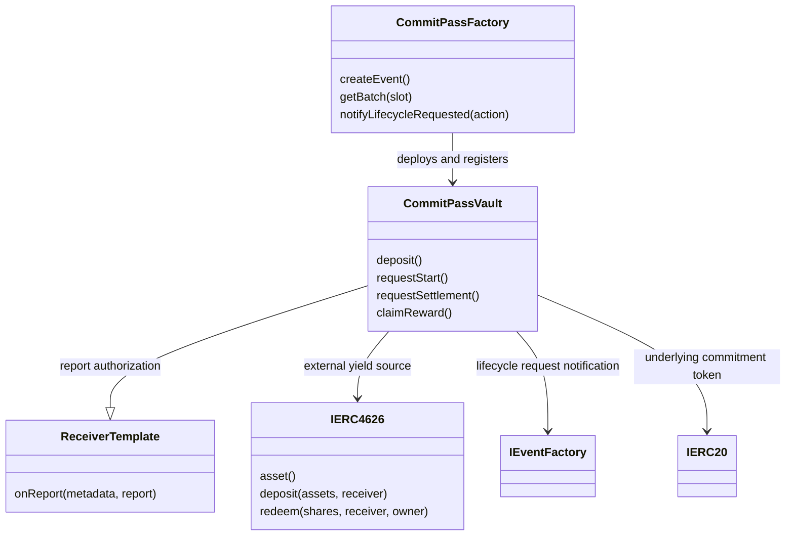

# Smart Contract Architecture

## CommitPassFactory

`createEvent(...)` deploys and registers a dedicated vault. It installs the organizer, fixed commitment, capacity, registration deadline, event date, settlement time, treasury, yield source and immutable CRE permissions atomically. Capacity is limited to 500 participants.

The factory exposes `isVault`, `vaultByEventId` and `getBatch(slot)` for discovery. Only registered vaults can call `notifyLifecycleRequested(uint8 action)` through the separate `IEventFactory` interface. The shared factory log is the CRE organizer-request trigger source.

## CommitPassVault: event and CRE consumer

Each vault inherits `ReceiverTemplate` and implements `onReport(bytes metadata, bytes report)`. There is no separately deployed lifecycle automation contract in the active architecture.

Only the organizer can call `requestStart()` or `requestSettlement()`. These establish eligibility and the cutoff. Only the configured forwarder can deliver lifecycle reports, with the workflow identity or signed testnet authorization validated by the receiver base.

The vault accepts one fixed USDC deposit per participant, closes registration, supplies pooled funds to its configured ERC-4626 source, redeems shares at settlement, fixes claim allocations and transfers each claim once through `claimReward()`. Entitlements belong to original depositors rather than subsequent share-token holders. Organizer ownership cannot be transferred or renounced.

Reports validate chain and vault domain, eligible action, expiry, cutoff, snapshot digest and deposited membership. Duplicate reports do not invest or allocate twice; conflicting snapshots are rejected.

## ReceiverTemplate

This abstract base is included in each vault and is never deployed separately. Forwarder and report authorization are immutable.

* Standard mode checks a nonzero workflow ID in forwarded metadata.
* Current simulation mode requires chain ID 10143, an immutable signer and workflow ID zero. It verifies an EIP-712 signature bound to the receiving vault.

Moving to DON execution requires the actual forwarder and workflow identity in a new immutable configuration.

## MockYieldVault

The ERC-4626 fixture is backed by Circle native testnet USDC. It exercises deposit and redemption but does not invest in Morpho or generate organic yield.

[Vault source](https://github.com/EndPx/commitpass/blob/main/contracts/src/CommitPassVault.sol) · [Factory source](https://github.com/EndPx/commitpass/blob/main/contracts/src/CommitPassFactory.sol) · [Active addresses](../deployments/monad-testnet.md) · [Payout rules](../protocol/commitments-and-rewards.md)

The factory and recorded browser-created vault have explorer source verification. Verification is address-specific; later vaults need their exact constructor verified. An independent security audit is not claimed.

## Contract relationships

The event vault consumes CRE reports; the external ERC-4626 source holds invested commitments. These roles must not be combined into a claim that the event vault itself exposes the entire ERC-4626 interface.
